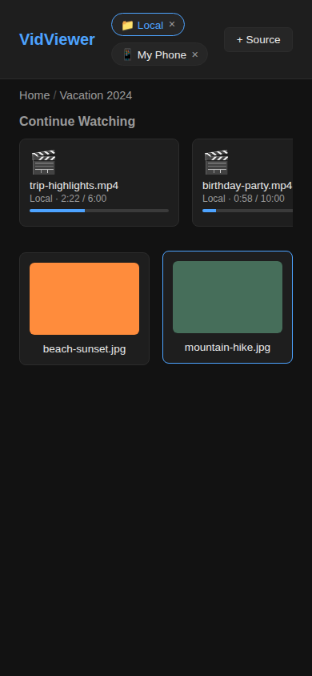
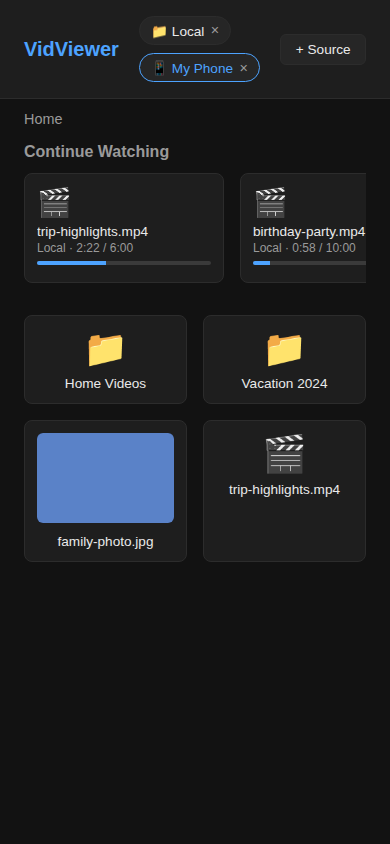
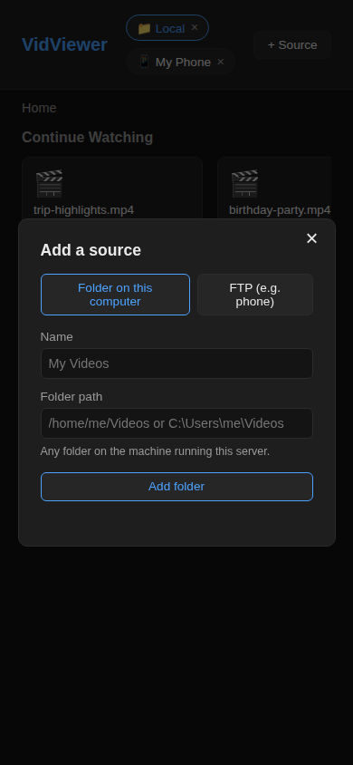
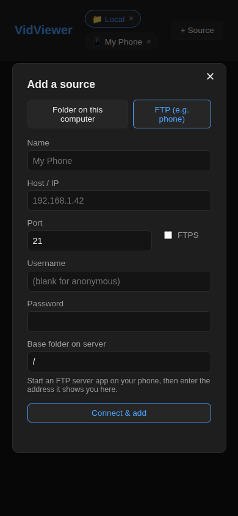
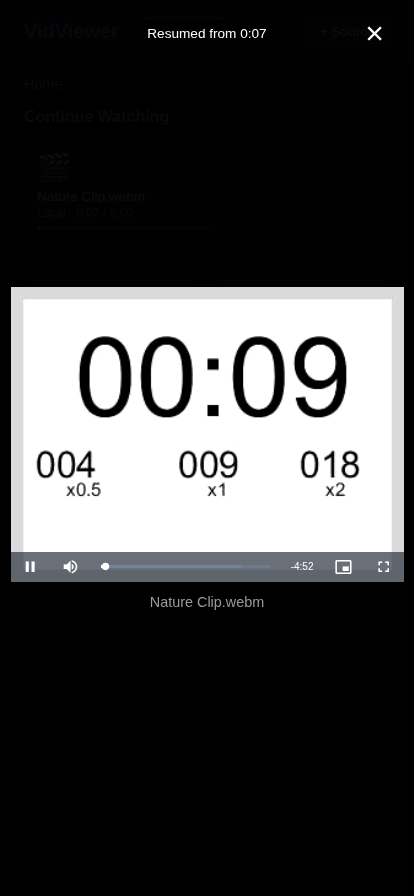

# VidViewer

A tiny web app that runs on your laptop and lets you browse folders —
including folders on your **phone** shared over FTP — then play videos
and view images from any browser on your local network (including your
laptop itself). It remembers what you've watched and picks up video
playback where you left off.

Built with **Next.js** (App Router) and **[video.js](https://videojs.com/)**
for playback.

## Screenshots

<table>
<tr>
<td align="center"><b>Home</b><br>sources, Continue Watching, folders/files</td>
<td align="center"><b>Browsing a folder</b><br>real image thumbnails</td>
<td align="center"><b>Browsing over FTP</b><br>same folder, fetched from a phone</td>
</tr>
<tr>
<td></td>
<td></td>
<td></td>
</tr>
<tr>
<td align="center"><b>Add a source — folder</b></td>
<td align="center"><b>Add a source — FTP</b></td>
<td align="center"><b>Resuming a video</b><br>picks up right where you left off</td>
</tr>
<tr>
<td></td>
<td></td>
<td></td>
</tr>
</table>

### Demo video

A short walkthrough (real downloaded sample video + images): browsing,
playing a video, closing and reopening it to show resume-from-last-position,
then paging through images.

<video src="docs/screenshots/demo.webm" controls width="360"></video>

(If the player above doesn't render, [download the video directly](docs/screenshots/demo.webm).)

## Requirements

Node.js **22.5 or newer** (uses the built-in `node:sqlite` module, no
native build tools required).

## Run it

### Windows

Double-click won't work for a `.ps1` file by default, so run it from a
terminal (PowerShell or Windows Terminal), from the project folder:

```powershell
.\Start-VidViewer.ps1
```

If Windows blocks the script from running ("running scripts is
disabled on this system"), either right-click it in Explorer → **Run
with PowerShell**, or run:

```powershell
powershell -ExecutionPolicy Bypass -File .\Start-VidViewer.ps1
```

It installs dependencies and builds the app on first run, opens a
Windows Firewall rule for the port so other devices on your network
can reach it (only if run as Administrator — otherwise accept the
firewall prompt Windows shows you), opens your browser once it's up,
and prints the network URL. Useful options:

```powershell
.\Start-VidViewer.ps1 -MediaRoot "D:\Videos" -Port 8080
```

Run `Get-Help .\Start-VidViewer.ps1 -Full` for all of them. Press
`Ctrl+C` in that terminal to stop the server.

**"It works on the laptop but not from my phone"** is almost always
one thing: Windows categorizes each network as Private or Public, and
the firewall rule above only opens the port for Private/Domain
networks — a network left as Public (common for a new Wi-Fi
connection) silently blocks every other device on it. If run as
Administrator, the script now detects this and offers to fix it; you
can also check/fix it yourself:

```powershell
Get-NetConnectionProfile                                         # look for NetworkCategory: Public
Get-NetConnectionProfile | Set-NetConnectionProfile -NetworkCategory Private
```

If that's not it, double-check your phone is on the *same* Wi-Fi
network (not mobile data or a separate guest network — guest networks
often isolate devices from each other on purpose).

#### Running it as a background service (starts on boot)

`Start-VidViewer.ps1` only runs while its terminal window is open. To
have VidViewer start automatically in the background whenever Windows
boots — no terminal window, no logging back in required — install it
as a real Windows Service instead:

```powershell
.\Install-VidViewerService.ps1
```

This prompts for Administrator rights (via UAC) if needed, then
builds the app, opens the same firewall rules, registers a service
named **VidViewer**, and starts it. It takes the same `-Port`,
`-MediaRoot`, and `-MdnsName`/`-NoMdns` options as `Start-VidViewer.ps1`;
whatever you pass gets baked into the service (a Windows Service has
no terminal environment of its own, so this is the only time those
settings can be set — reinstall to change them).

Once installed, manage it like any other service:

```powershell
Get-Service VidViewer
Restart-Service VidViewer
Stop-Service VidViewer
```

or via `services.msc`. If it won't start, check the logs it writes to
the `daemon\` folder this creates. Windows restarts it automatically
if it crashes, and it comes back up on its own after every reboot —
nothing more to run.

If a device on your network can't reach VidViewer (e.g. "works on
this laptop, not on my phone"), run `.\Show-VidViewerStatus.ps1` — a
read-only diagnostic that checks the LAN IP(s), whether the port/mDNS
firewall rules exist, whether the service is running, and whether the
current network is categorized Public (the most common cause).

To remove it:

```powershell
.\Uninstall-VidViewerService.ps1
```

(Your sources and watch history in `data\vidviewer.db` are untouched.)

### macOS / Linux

```bash
npm install
npm run build
npm start
```

For development (hot reload):

```bash
npm install
npm run dev
```

On first run it automatically adds a "Local" source pointing at your
home directory. To point that default source at a specific folder
instead, set `MEDIA_ROOT` before the very first run:

```bash
MEDIA_ROOT="/path/to/your/media" npm start
```

(You can also add/remove folders later from the app itself — see below.)

On start it prints the URLs to open:

```
VidViewer starting (start)
  Local:   http://localhost:3000
  Network: http://192.168.1.23:3000
  Network: http://vidviewer.local:3000  (once other devices pick it up)
```

- Open the **Local** URL on the laptop itself.
- Open the **Network** URL from any other device on the same Wi-Fi/LAN
  (phone, tablet, another computer) to browse and play the same files.

Use `PORT=8080 npm start` to change the port.

### A friendly name instead of an IP address

The server advertises itself over mDNS (Bonjour/zeroconf) as
`vidviewer.local`, so other devices on the same network can use that
name instead of an IP address that changes every so often. It works
out of the box on macOS, iOS, Android, and modern Windows/Linux — no
router configuration needed. If a name doesn't resolve, that device or
network just doesn't support mDNS (some corporate/guest Wi-Fi networks
block the multicast traffic it relies on); fall back to the IP URL.

- Change the name: `MDNS_NAME=movienight npm start` (on Windows:
  `.\Start-VidViewer.ps1 -MdnsName movienight`), giving you
  `http://movienight.local:3000`.
- Turn it off: `MDNS_DISABLED=1 npm start` (Windows: `-NoMdns`).
- This is a plain `<name>.local` → IP answer, not a "real" domain —
  don't reuse an actual TLD like `.com` for `MDNS_NAME`; devices would
  only resolve it your way on this network, and it can conflict with
  HTTPS-only browser behavior for names that look like real domains.

## Using it

- The tabs at the top switch between **sources** — folders on this
  computer, or FTP connections (e.g. your phone). Click **+ Source**
  to add another one.
- Click a folder to open it, use the breadcrumb to go back.
- Click a video to play it (with seeking support); click an image to
  view it full-screen, with on-screen arrows / left-right arrow keys
  to move between images in the same folder.
- Press `Esc` or the `×` button to close the player.

### Adding your phone as a source (FTP)

1. On your phone, install an FTP server app (e.g. "FTP Server" or
   "Primitive FTPd" on Android) and start it — it will show you an
   address like `ftp://192.168.1.42:2221` and a username/password.
2. In VidViewer, click **+ Source** → **FTP (e.g. phone)**, fill in the
   host/IP and port it showed you (skip username/password if it's
   running as anonymous), and click **Connect & add**.
3. Your phone's shared folder now shows up as a browsable source,
   exactly like a local folder — same video/image playback, same
   history and resume support.

Both the phone and the laptop need to be on the same Wi-Fi network.

### Playing a direct video/image URL

Click **+ Source** → **Direct URL**, give it a name and paste a direct
link to a video or image file (not a webpage — a link that itself
serves the file). The server fetches it and streams it to your
browser, so seeking works the same as with local files, and it gets
the same watch-history/resume support. Only use links you actually
have the right to view — the server has no way to check that for you.

### Continue watching

Every video you watch has its playback position saved automatically
(persisted in a local SQLite database). A **Continue Watching** strip
appears at the top of the browser showing your recently-played videos
across all sources with a progress bar; clicking one resumes right
where you left off. Videos you've finished (or are within ~3% of the
end) start over from the beginning next time.

### Converting an unsupported video

Not every device can play every format — a `.mkv` that plays fine on
your laptop or phone can fail with "No compatible source was found"
on something like a Fire TV Stick's browser, which supports a much
narrower set of containers/codecs. When that happens on a **local**
source, the player offers a **Convert to MP4** button right there;
click it and VidViewer re-encodes the file to H.264/AAC MP4 in the
background (via a bundled ffmpeg), shows progress, and switches the
player over to the new file once it's done. The original file is left
alone — the converted copy is saved alongside it with the same name
and a `.mp4` extension, so it also shows up as a separate file in the
folder from then on. This isn't available for FTP or Direct-URL
sources, since there's nowhere sensible to write the converted file
back to.

## Notes

- Only files under a source's configured root can be accessed (path
  traversal is blocked), so it's safe to point a local source at a
  specific media folder rather than your whole home directory.
- Supported video formats: mp4, webm, ogg/ogv, mov, m4v, mkv (actual
  playback support depends on your browser's codec support — see
  "Converting an unsupported video" above for local files that won't
  play on a particular device).
- Supported image formats: jpg, jpeg, png, gif, webp, bmp, svg.
- Source settings and watch history are stored in a SQLite file at
  `data/vidviewer.db` (override the location with `DB_PATH`). FTP
  passwords are stored there in plain text, so treat that file like a
  credential — it's already excluded from git via `.gitignore`.
- FTP streaming opens a fresh connection per file/seek and relies on
  the phone's FTP server supporting the `SIZE`/`REST` commands for
  seeking; most FTP server apps do.
- This app has no authentication — anyone on your local network can
  use it while the server is running. Don't run it on untrusted
  networks (e.g. public Wi-Fi).
- Direct-URL sources make the server fetch whatever URL it's given
  and stream the response back — combined with no authentication,
  that means anyone on your LAN could point it at an internal address
  reachable from your laptop. Keep that in mind on networks you don't
  fully trust.
- The mDNS responder listens on UDP port 5353. On macOS/Linux, allow
  it through your firewall the same way you would any local dev
  server (usually nothing to do — most desktop firewalls there don't
  block outbound multicast responses by default); on Windows, the
  launcher script handles it (see above).

## Project structure

- `app/` — Next.js App Router pages and API route handlers
  (`app/api/*/route.js`) for sources, browsing, media streaming, and
  playback progress.
- `components/` — React UI (source tabs, folder/file grid, the
  video.js-based player, etc.).
- `lib/` — framework-agnostic server logic: SQLite access (`db.js`),
  local filesystem browsing/streaming (`local.js`), FTP
  browsing/streaming (`ftp.js`), direct-URL streaming (`urlSource.js`),
  MKV/etc-to-MP4 conversion via a bundled ffmpeg (`convert.js`).
- `scripts/run.js` — runs the mDNS responder (`scripts/mdns.js`)
  alongside the Next.js server under one `npm run dev`/`npm start`, so
  Ctrl+C stops both.
- `scripts/service/` — installs/uninstalls the Windows Service (via
  `node-windows`), used by `Install-VidViewerService.ps1` /
  `Uninstall-VidViewerService.ps1`.

Both `next dev` and `next build` run on webpack (`--webpack`) rather
than Turbopack, since Turbopack's build-time module tracing currently
chokes on the `node:sqlite` built-in.
